
# Game-Puzzle-Matematika-Android

Sebuah game puzzle matematika untuk android yang dibuat dengan menggunakan Godot game engine.

Tujuan utama dari pembuatan game ini adalah untuk edukasi dan non-komersial. Pembuat tidak memperoleh keuntungan materi sepeserpun dari game ini.

  

# Cara Install

1. Download APK di Releases.

2. Install APK di Android/Emulator (Pastikan Android mengijinkan installasi lewat sumber yang tidak di kenal).

3. Game siap untuk dimainkan.

  

# Cara Bermain

Pemain mengendalikan sebuah pesawat luar angkasa dimana pemain harus menghindari meteor dengan cara memilih jawaban dari pertanyaan yang tampil di bagian paling atas layar. Pesawat pemain memiliki 3 nyawa dan setiap kali pemain memilih jawaban yang salah maka pesawat pemain akan tertimpa meteor dan nyawa pesawat dikurangi 1.

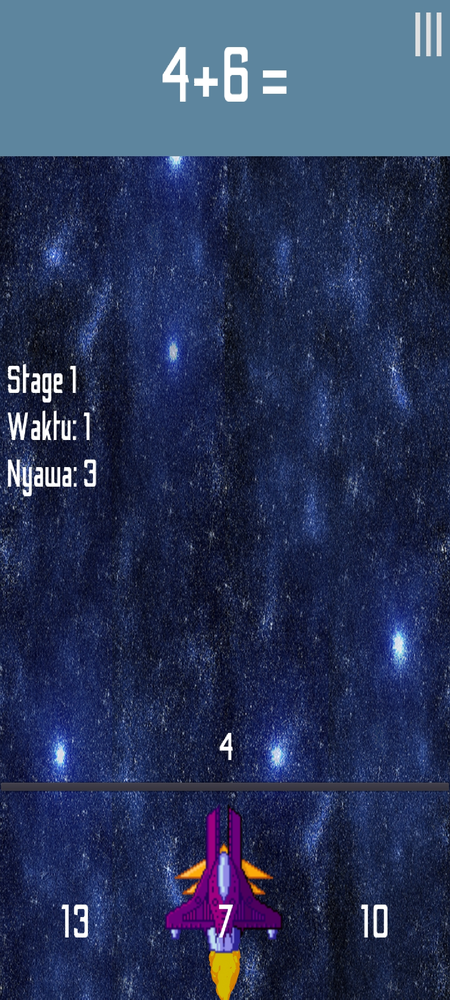

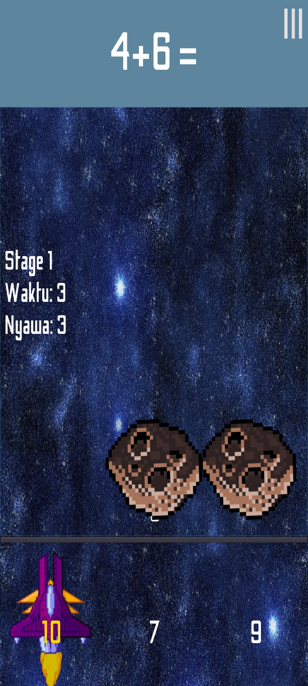

Jika pemain berhasil menjawab semua pertanyaa tanpa mengurangi nyawa sampai dibawah 0, maka pemain bisa mengakses stage berikutnya.

Jika nyawa pemain sampai nol maka akan muncul menu Gameover.
  
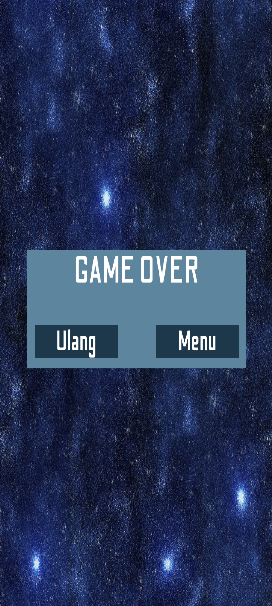

Untuk mempercepat waktu pemain bisa menekan layar antara lokasi pertanyaan dan lokasi jawaban.

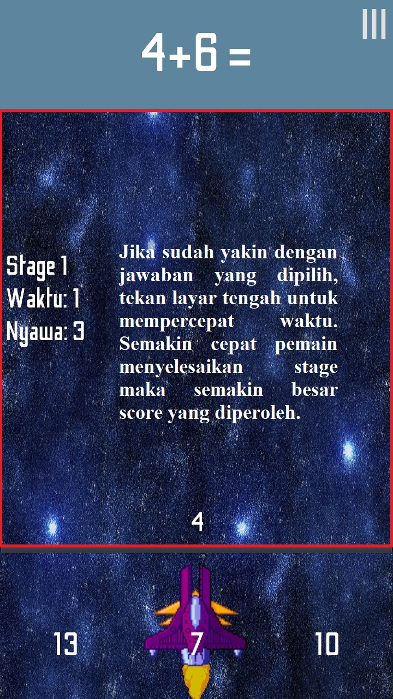

Semakin cepat pemain menjawab pertanyaan maka semakin tinggi nilai yang diperoleh.

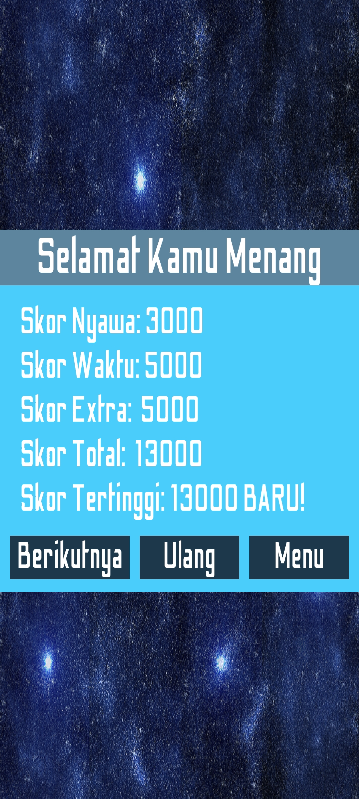

Pemain bisa menekan tombol "⦀" untuk mempause game. Lewat menu pause pemain bisa mengulang stage, kembali ke pemilihan stage atau melanjutkan bermain stage.

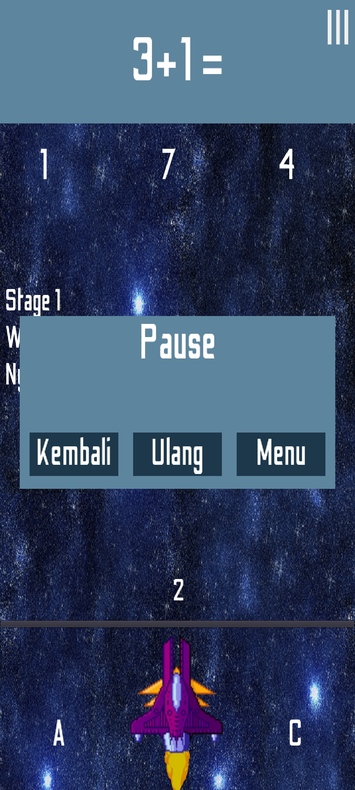
  
# Lainnya
## Stage
Untuk saat ini, game hanya memiliki 13 stage dimana stage dibagi menjadi tiga bagaian yaitu untuk SD, SMP dan SMA sesuai dengan kesulitan.

Stage bisa diakses setelah pemain menyelesaikan stage sebelumnya sesuai dengan tingkat kesulitan. (Contoh: Pemain bisa mengakses stage 2 dari tingkat kesulitan SMP jika pemain bisa menyelesaikan stage 1 untuk tingkat SMP)

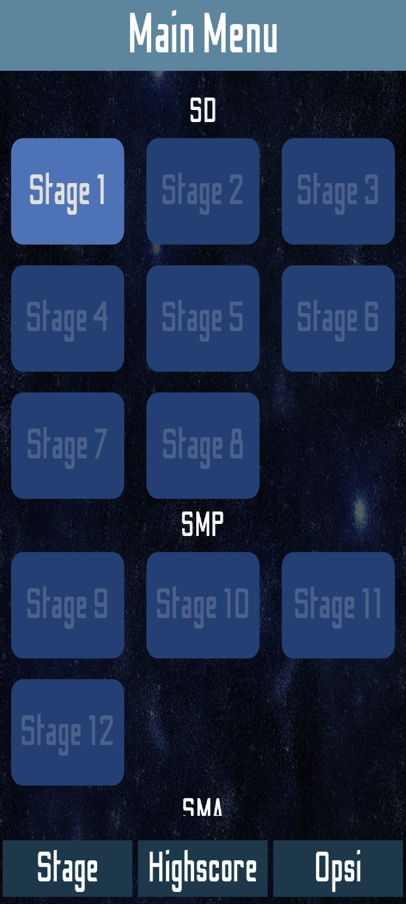

## Highscore
Sleain itu pemain juga bisa melihat highscore dari setiap stage dengan cara menekan tombol Highscore pada bagian bawah main menu.

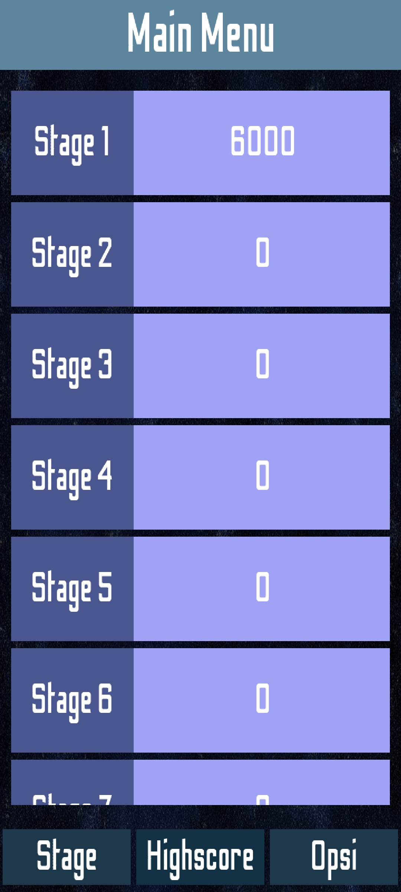
  
## Option
Pemain bisa mengakses menu option dengan mengklik tombol Option pada main menu. Disini pemain bisa mengatur keras suara dari game serta menghapus save mereka dengan mengklik tombol Restart dan confirmasi menu popup yang muncul.

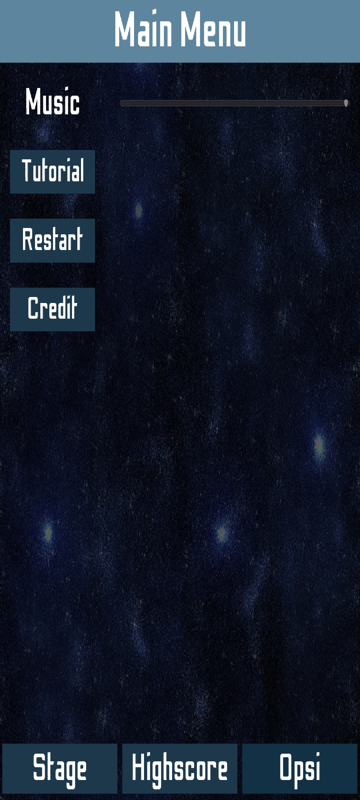

## Tutorial
Pemain bisa mengakses tutorial dengan mengklik tombol Tutorial pada menu option. Disini pemain bisa melihat cara dan aturan bermain game.

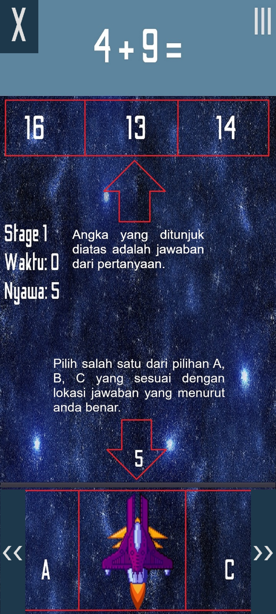

## Credit
Pemain bisa mengakses credit dengan mengklik tombol Credit pada menu option. Disini pemain bisa melihat nama orang-orang yang berjasa dalam pengembangan game.

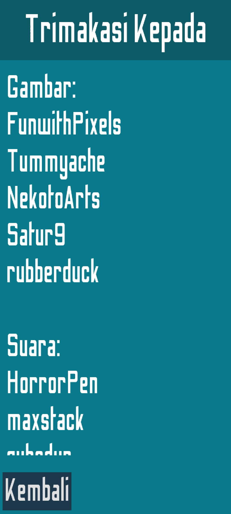

# Credit

Semua aset gambar dan suara yang digunakan di game ini bukanlah buatan saya melainkan di download dari website OpenGameArt.org.

  

Berikut adalah pembuat dari gambar dan suara yang digunakan di game ini:

  

## Gambar

  

FunwithPixels - Pembuat Gambar "Brown Asteroid" dari https://opengameart.org/content/brown-asteroid dengan lisensi CC-BY 4.0, CC-BY-SA 4.0, CC-BY-SA 3.0 dan CC-BY 3.0.

  

Tummyache - Pembuat Gambar “Purple Space Ship” dari https://opengameart.org/content/purple-space-ship dengan lisensi CC0.

  

NekotoArts - Pembuat Gambar "2D Toon Fire Animation" dari https://opengameart.org/content/2d-toon-fire-animation dengan lisensi CC0.

  

Satur9 - Pembuat Gambar "Space Background 01" dari https://opengameart.org/content/space-background-01 dengan lisensi CC0.

  

rubberduck - Pembuat Gambar “Free Metal-Texture-Creation-Set 06" dari https://opengameart.org/content/free-metal-texture-creation-set-06 dengan lisensi CC0.

  

## Suara

  

HorrorPen - Pembuat Suara “Loop - House In a Forest” dari https://opengameart.org/content/loop-house-in-a-forest dengan lisensi CC-BY 3.0.

  

maxstack - Pembuat Suara “Through Space” dari https://opengameart.org/content/through-space dengan lisensi CC-BY-SA 3.0.

  

qubodup - Pembuat Suara "Crash Collision" dari https://opengameart.org/content/crash-collision dengan lisensi CC0.

  

Fupi - Pembuat Suara "Correct Bell" dari https://opengameart.org/content/correct-bell dengan lisensi CC0.

  

Oiboo - Pembuat Suara “Game Over - Bad chest SFX” dari https://opengameart.org/content/game-over-bad-chest-sfx dengan lisensi CC0.

  
## Akhiran

Saya mengucapkan terimakasih sedalam-dalamnya kepada semua orang yang telah membantu dalam proses pembuatan game ini baik secara langsung beserta tidak langsung.
